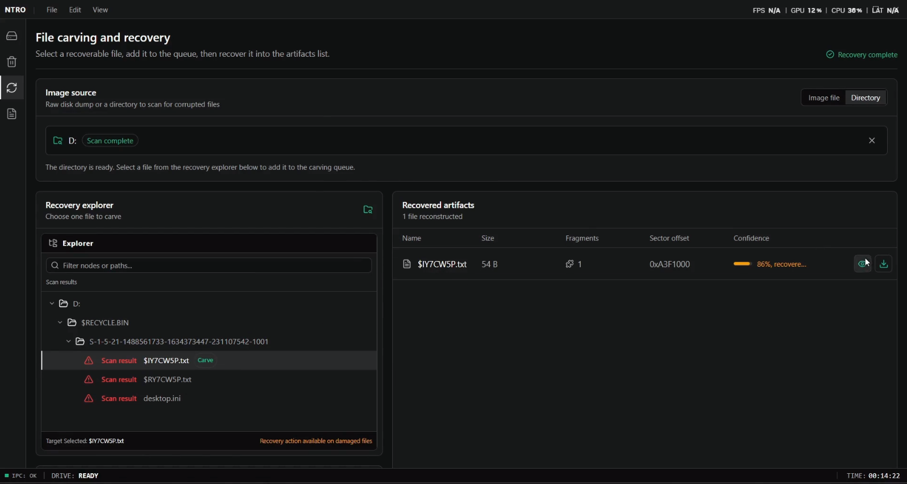
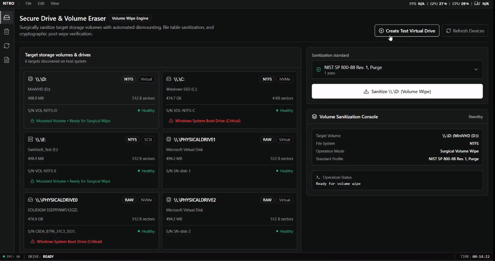
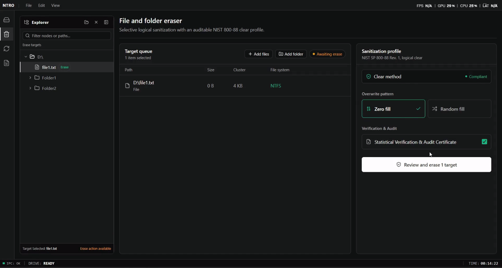
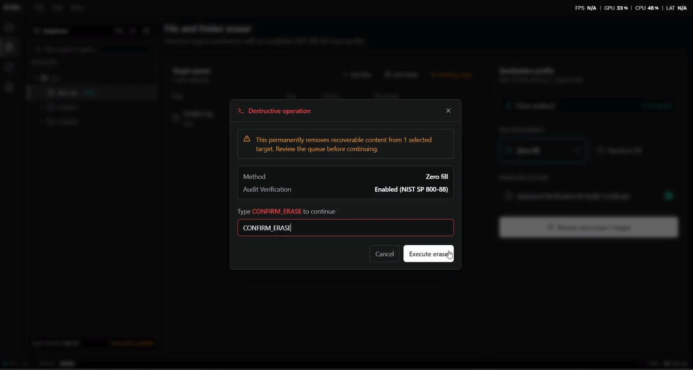
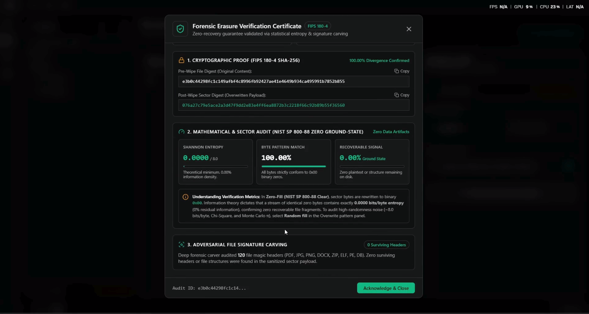
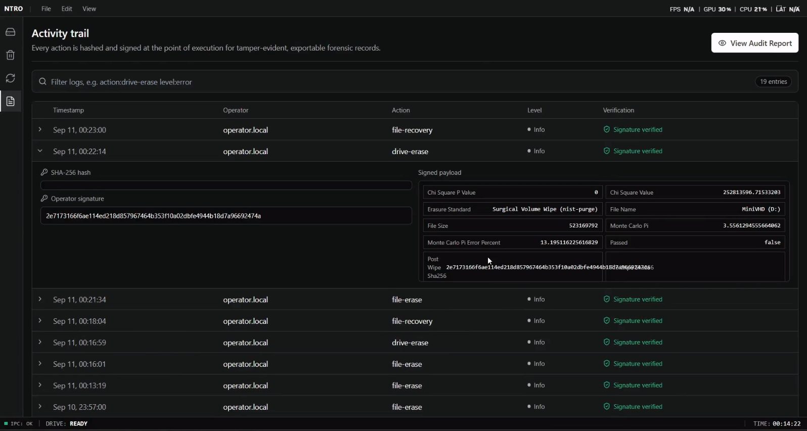

<h1 align="center">
  
  &nbsp;&nbsp;&nbsp;SanitizeX
</h1>

<p align="center">
  <strong>Enterprise- and Defense-Grade Multi-Filesystem Data Sanitization, Forensic Recovery, and Cryptographic Verification Platform</strong>
</p>

<p align="center">
  <a href="#compliance-and-standards"></a>
  <a href="#compliance-and-standards"></a>
  <a href="#architecture"></a>
  <a href="#key-features"></a>
</p>

---

## Project Information

- **Project Title**: SanitizeX - Integrated Solutions for Data Sanitization and Recovery
- **PS ID**: SIH2026 - 26149
- **PS Title**: Design and Development of an Integrated Secure Data Erasure and Advanced File Recovery Tool for Digital Forensics and Data Sanitization
- **Category**: Software
- **Theme**: Blockchain & Cybersecurity

---

## Problem Statement

The project aims to develop an integrated **Secure Data Erasure and Advanced File Recovery Tool** for digital forensics and data sanitization. Existing solutions typically focus on either securely destroying data or recovering deleted files, requiring multiple tools and workflows. Our system combines three core capabilities: **secure drive erasure, secure file/folder erasure, and advanced file carving and recovery**. It will support secure and verifiable data sanitization with audit logging, while the recovery module will recover deleted, formatted, fragmented, or corrupted files using filesystem metadata, file signatures, structural analysis, and carving techniques. The system will prioritize read-only forensic analysis, file validation, fragmented-file reconstruction, confidence scoring, and comprehensive reporting to preserve evidential integrity.


---

## Proposed Solution

SanitizeX provides a defense- and enterprise-grade storage sanitization, forensic analysis, and cryptographic verification platform. Engineered with a decoupled 3-tier architecture, it couples kernel-bypassing surgical file and volume eradication across diverse storage hardware (HDD, SATA SSD, NVMe) with an immutable read-only forensic recovery subsystem, an adversarial mathematical verification loop, and a modern desktop user interface.

- **Surgical Metadata Destruction**: Eradicates targeted files down to the physical sectors and cleans internal filesystem metadata structures without damaging surrounding volume geometry.
- **Direct Hardware Access**: Bypasses operating system write caches using direct Win32 and POSIX I/O flags.
- **Adversarial Verification Loop**: Proves data destruction using Shannon Entropy, Chi-Square Goodness-of-Fit, Serial Correlation, Monte Carlo $\pi$, and multi-signature carving.
- **Forensic Recovery Subsystem**: Safely parses partition tables (MBR/GPT) and salvages deleted or orphaned files under strict read-only guarantees.
- **Tamper-Evident Audit Ledger**: Generates cryptographic verification reports with pre- and post-erasure SHA-256 digests.

---

## Key Features

- **Multi-Filesystem Surgical Erasure**: Pinpoint file and directory eradication natively implemented for NTFS, ext4, exFAT, FAT32, and XFS.
- **Direct-to-Hardware Sanitization**: Raw physical disk and volume wiping bypassing operating system write-caching via direct Win32 (`CreateFileW` / `DeviceIoControl`) and POSIX direct I/O (`O_DIRECT` / `ioctl`).
- **NIST SP 800-88 & DoD 5220.22-M Compliance**: Built-in sanitization routines including single-pass zero-fill, 3-pass DoD overwrite, and hardware-level NVMe Sanitize / ATA Secure Erase / TRIM.
- **Adversarial Verification Loop**: Multi-tier statistical audit engine testing byte randomness (Shannon Entropy, Chi-Square, Serial Correlation, Monte Carlo $\pi$) and executing a 120+ format signature carver.
- **Read-Only Forensic Recovery**: Non-destructive partition scanning, NTFS unallocated MFT reconstruction, and raw sector signature carving with confidence scoring.
- **Tamper-Evident Audit Ledger**: Cryptographically sealed records capturing operator identity, hardware serial numbers, timestamps, SHA-256 pre/post digests, and pass/fail verdicts.
- **Modern Desktop Shell**: Cross-platform Electron 44 desktop application with a React 19 and Tailwind CSS mission-control dashboard.

---

## Technology Stack

<p align="center">
  
  
  
  
  
  
  
  
  
  
  
  
</p>

### Architecture and Stack Breakdown

| Layer / Domain | Technologies & Libraries | Responsibility |
| :--- | :--- | :--- |
| **Core Erasure & Recovery** | `C++17`, `CMake` | Bare-metal surgical deletion drivers, partition parsers, statistical test suites, and raw-sector carvers. |
| **Native Interoperability** | `pybind11` | High-throughput, zero-copy extensions bridging native C++ binaries (`.pyd` / `.so`) with the Python application layer. |
| **IPC & Orchestration** | `Python 3.14.7`, `Flask`, `Flask-SocketIO`, `Pydantic` | Asynchronous job execution pipeline, WebSocket state broadcasting, administrative privilege validation, and audit persistence. |
| **Desktop Shell** | `Electron 44`, `Node.js` | Sandboxed desktop application runtime managing native file dialogs, system device enumeration, and secure IPC bridges. |
| **Client UI** | `React 19`, `TypeScript 5`, `Vite 7`, `Tailwind CSS`, `Lucide Icons` | Mission-control interface with drive selection, selective tree deletion, recovery scanning, and live entropy inspections. |

---

## Architecture

See [docs/architecture.md](docs/architecture.md) for detailed technical specifications, sequence diagrams, and mathematical formulations.

```text
User / Security Operator
          │
          │ User Interaction & Configuration
          ▼
Electron Desktop Frontend (React 19 + TypeScript + Tailwind CSS)
          │
          │ Typed ContextBridge IPC / Secure WebSocket Events
          ▼
Backend API & Orchestration (Python 3.14.7 + Flask + Flask-SocketIO)
          │
          ├── Privileged Gatekeeper (Windows RunAs / POSIX root)
          ├── Asynchronous Worker Threads (Drive Erase, File Erase, Forensic Scan)
          │
          ├────────────────────────────────────────┬────────────────────────────────────────┐
          │ Dynamic Execution                      │ Audit Persistence                      │
          ▼                                        ▼                                        ▼
pybind11 Native Extension Bridge          Cryptographic Audit Ledger              OS & Storage Hardware
(osdevice, hdd, ntfs, ext4,                (audit_logs.json with SHA-256           (Win32 DeviceIoControl,
 fat32, exfat, verification, recovery)     pre/post digests & timestamps)          POSIX O_DIRECT, TRIM)
          │
          ▼
Core C++17 Engines & Subsystems
  ├── Surgical Filesystem Drivers (NTFS, ext4, exFAT, FAT32, XFS)
  ├── Hardware Erasure Protocols (DoD 5220.22-M, NIST SP 800-88, NVMe Sanitize)
  ├── Adversarial Verification Loop (Shannon Entropy, Chi-Square, Monte Carlo Pi, 120+ Carvers)
  └── Read-Only Forensic Recovery Engine (MBR/GPT Parsers, MFT Reconstructor, Signature Carver)
          │
          │ Mathematical Verdicts, Progress Metrics & Carved Artifacts
          ▼
Backend Event Hub (Socket.IO Broadcast)
          │
          │ Real-Time Streaming Telemetry
          ▼
Electron Desktop Frontend (Mission Control Dashboard)
          │
          ▼
User / Verification Report Export
```

---

## Compliance and Standards

| Standard / Algorithm | Passes / Pattern | Target Application |
| :--- | :--- | :--- |
| **NIST SP 800-88 Rev. 1 Clear** | 1 Pass (Logical Zero-Fill `0x00`) | Standard media sanitized for internal re-use |
| **NIST SP 800-88 Rev. 1 Purge** | Cryptographic PRNG / Firmware Purge | Physical drives cleared for cross-classification transfer |
| **DoD 5220.22-M** | 3 Passes (`0x00` $\rightarrow$ `0xFF` $\rightarrow$ CSPRNG Pseudo-Random) | Defense-grade magnetic and solid-state sanitization |
| **Hardware Secure Erase** | Native ATA Secure Erase / NVMe Sanitize / TRIM | Direct controller-level flash cell eradication |

---

## Repository Structure

```text
Secure-data-erasure-and-recovery/
├── README.md                # Project documentation and setup guide
├── requirements.txt         # Python backend dependencies
├── LICENSE                  # License terms
├── docs/
│   └── architecture.md      # Comprehensive system architecture document
├── submission/
│   ├── PaperRex_SIH2026.pdf # Presentation deck
│   └── PaperRex_SIH2026 - Video Demo.mp4 # Video demonstration
├── assets/
│   └── screenshots/         # Application screenshots and diagrams
└── src/
    ├── _externals/          # Filesystem check utilities (e2fsck, ntfsfix, fsck.*)
    ├── backend/             # Python Flask + Socket.IO server & audit persistence
    │   ├── main.py          # REST & WebSocket API, worker threads, admin checks
    │   └── audit_logs.json  # Cryptographic audit trail ledger
    ├── build_modules/       # Native C++17 core libraries
    │   ├── Erasure/         # Surgical filesystem drivers, hardware I/O, verification
    │   └── Recovery/        # Forensic disk parsing, carving, recovery tools
    ├── frontend/            # Electron 44 + React 19 + TypeScript desktop app
    │   ├── src/main/        # Electron main process & IPC bridges
    │   ├── src/preload/     # Secure ContextBridge APIs
    │   └── src/renderer/    # React 19 UI components & Tailwind styles
    └── modules/             # pybind11 C++ export wrappers & compiled modules (.pyd/.so)
```

### Component Placement Reference

| Item | Location |
| :--- | :--- |
| **Source code** | `src/` |
| **Architecture / technical documentation** | `docs/architecture.md` |
| **Project screenshots / visual assets** | `assets/screenshots/` |
| **Final presentation** | `submission/` |
| **Demo video** | `submission/` |
| **Project overview & guide** | `README.md` |

---

## Final Presentation

- The presentation deck is located in the `submission/` directory:
  - `submission/PaperRex_SIH2026.pdf`

---

## Demo Video

- The video demonstration is located in the `submission/` directory:
  - `submission/PaperRex_SIH2026 - Video Demo.mp4`

---

## Screenshots / Prototype Photos

Visual overview of the SanitizeX mission-control desktop interface and core operational modules:

### 1. Forensic File Recovery Module
> Non-destructive partition scanning, MFT reconstruction, raw sector signature carving, and confidence-scored file restoration under read-only guarantees.

<p align="center">
  
</p>

---

### 2. Secure Drive Erasure Module
> Physical and logical storage device selection with compliant sanitization protocols (NIST SP 800-88 Rev. 1 Clear/Purge, DoD 5220.22-M 3-Pass).

<p align="center">
  
</p>

---

### 3. Surgical File & Folder Erasure Module
> Interactive filesystem tree navigation for surgical, pinpoint eradication of sensitive files and metadata across NTFS, ext4, FAT32, exFAT, and XFS.

<p align="center">
  
</p>

---

### 4. Real-Time Erasure Process & Telemetry
> Live execution dashboard displaying multi-pass progress, sector write throughput (MB/s), elapsed time, ETA, and operational status.

<p align="center">
  
</p>

---

### 5. Adversarial Verification Mechanism
> Multi-tier statistical audit engine testing byte randomness (Shannon Entropy, Chi-Square Goodness-of-Fit, Monte Carlo $\pi$) and signature carving to prove zero remanence.

<p align="center">
  
</p>

---

### 6. Tamper-Evident Cryptographic Audit Trail
> Immutable audit ledger recording operator metadata, drive hardware serials, timestamps, and pre/post-erasure SHA-256 verification digests.

<p align="center">
  
</p>

---

## Installation

### Prerequisites

- **C++ Compiler**: GCC 10+ / Clang 12+ (Linux) or MSVC v143 / MinGW-w64 (Windows)
- **CMake**: Version 3.15 or newer
- **Python**: Python 3.14.7 with development headers
- **Node.js**: Node.js 20+ and `npm`

### Step 1: Clone Repository

```bash
git clone https://github.com/Akarsh-x64/Secure-data-erasure-and-recovery.git
cd Secure-data-erasure-and-recovery
```

### Step 2: Build C++ Native Extensions (`src/modules`)

Compile the high-performance C++17 filesystem drivers and verification routines into Python bindings:

```bash
cd src/modules

# On Linux
cmake -B build -DCMAKE_BUILD_TYPE=Release
cmake --build build --config Release

# On Windows (Visual Studio 2022 x64)
cmake -B build -G "Visual Studio 17 2022" -A x64
cmake --build build --config Release
```

### Step 3: Configure Python Backend

```bash
# Return to root directory
cd ../..

# Create and activate virtual environment
python -m venv venv
source venv/bin/activate       # On Windows: .\venv\Scripts\activate

# Install dependencies
pip install -r requirements.txt
```

### Step 4: Install Desktop Frontend Dependencies

```bash
cd src/frontend
npm install
```

---

## Run

### Step 1: Start Backend API & IPC Bridge

Start the backend server (requires elevated administrator or root rights for low-level storage device access):

```bash
# Linux (root required for raw block device access)
sudo python src/backend/main.py

# Windows (auto-prompts UAC elevation if not already elevated)
python src/backend/main.py
```

### Step 2: Launch Electron & React Desktop Application

In a separate terminal:

```bash
cd src/frontend
npm run dev
```

### Build Production Desktop Packages

```bash
cd src/frontend
npm run build:linux   # Linux AppImage / deb
npm run build:win     # Windows NSIS Installer / portable .exe
```

---

## Future Scope

- **Distributed Remote Sanitization**: Extend the backend architecture to support remote fleet-wide sanitization over TLS-encrypted agent channels.
- **Hardware Security Module (HSM) Integration**: Integrate HSM-signed cryptographic certificates of sanitization for legal and regulatory compliance.
- **Extended Flash Translation Layer (FTL) Diagnostics**: Implement vendor-specific NVMe and SATA SMART wear-leveling block inspection to verify zero remanence in over-provisioned spare blocks.
- **Machine Learning Remanence Detection**: Deploy deep neural network models on residual raw bitstreams to detect subtle magnetic or voltage patterns indicating pre-wipe data structure.

---
